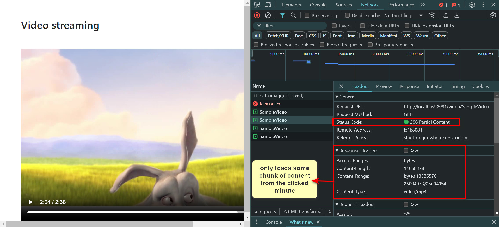

# Spring Boot WebFlux Video Streaming Application

## Overview
This application demonstrates a simple video streaming service using Spring Boot WebFlux. It allows videos to be served in chunks dynamically based on the user's playback position, improving load times and bandwidth usage.

## Technology Stack
- **Spring Boot WebFlux:** Enables building reactive, non-blocking web applications.
- **Java:** Programming language.
- **Maven:** Dependency management and project build.
- **Bootstrap:** For frontend styling.

## Features
- Video streaming by chunks using HTTP range requests.
- Reactive API that supports back-pressure and efficient data streaming.

## Dependencies
- `spring-boot-starter-webflux`: Core starter, including reactive web and Spring WebFlux.
- `spring-boot-devtools`: Provides fast application restarts, configurations, and more.
- `spring-boot-starter-test`: Support for testing Spring Boot applications with libraries including JUnit, Hamcrest, and Mockito.
- `reactor-test`: Provides a test kit for Reactor.

## Project Configuration
The application is configured with the following key settings in `application.properties`:

```properties
spring.application.name=springboot-webflux-video-streaming
server.port=8081
```

## Maven POM Configuration
The `pom.xml file` is configured to handle dependencies and the build lifecycle:

```xml
<dependency>
    <groupId>org.springframework.boot</groupId>
    <artifactId>spring-boot-starter-webflux</artifactId>
</dependency>
```

## Running the Application

```cmd
mvn spring-boot:run
```

## Application Structure

### Service Layer
The `StreamingService` class is responsible for providing the video resource:

```java
@Service
public class StreamingService {
    @Autowired
    public ResourceLoader resourceLoader;

    public Mono<Resource> getVideo(String title) {
        return Mono.fromSupplier(() -> resourceLoader.getResource("classpath:videos/" + title + ".mp4"));
    }
}
```

### Controller
The `SpringbootWebfluxVideoStreamingApplication` class contains a REST endpoint that serves video:

```java
@GetMapping(value = "video/{title}", produces = "video/mp4")
public Mono<Resource> getVideo(@PathVariable String title, @RequestHeader("Range") String range) {
    System.out.println("range in bytes() : " + range);
    return streamingService.getVideo(title);
}
```

### HTML Frontend
The `index.html` located in the `src/main/resources/static` folder sets up the video player:

```html
<video src="video/SampleVideo" width="720px" height="480px" controls preload="none"></video>
```

## Usage
- Start the application and navigate to `http://localhost:8081` in your browser.
- The video content is loaded dynamically as you interact with the player's timeline.

## Network Interaction
Using the browser's Network tab, users can observe how video chunks are loaded based on the playback position, demonstrating efficient data handling of the application.




## Conclusion
This application serves as a basic example of implementing reactive video streaming services with Spring Boot WebFlux, showcasing the efficiency of reactive programming in handling data streams and reducing server load.


